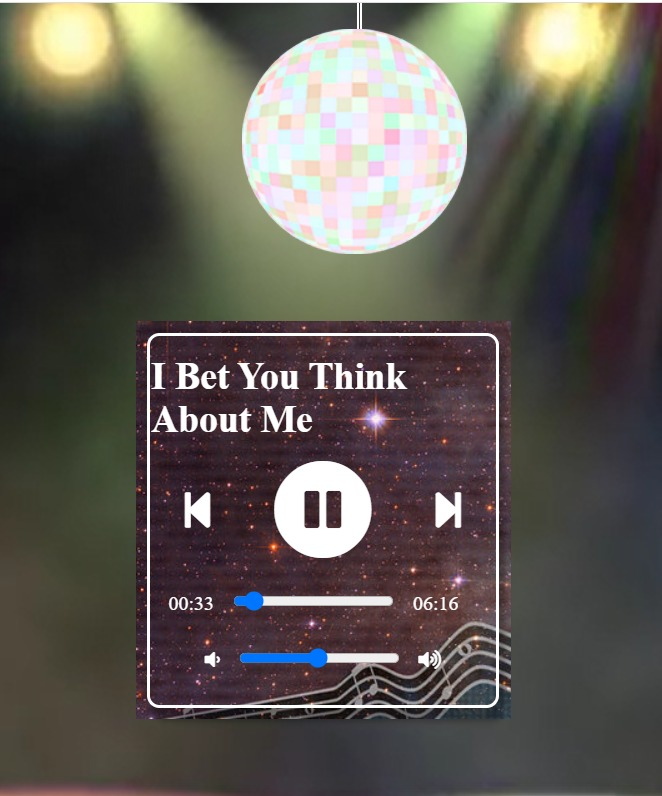
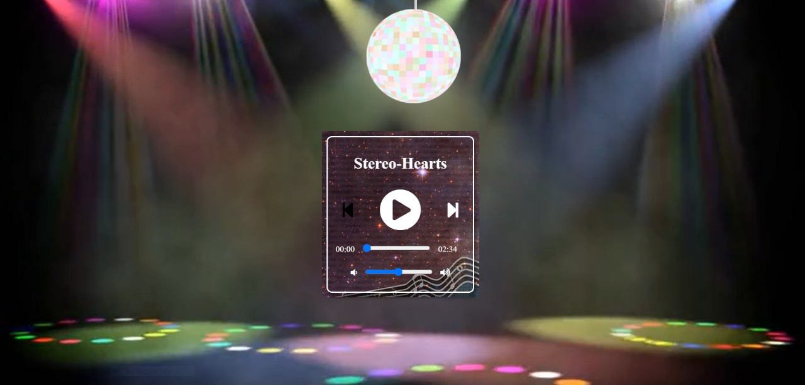
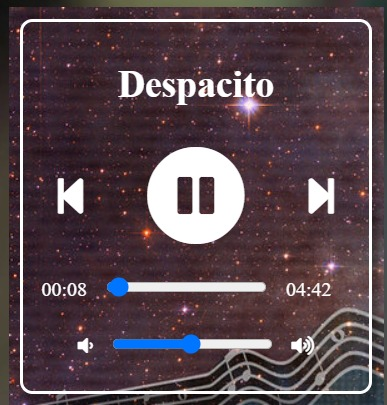
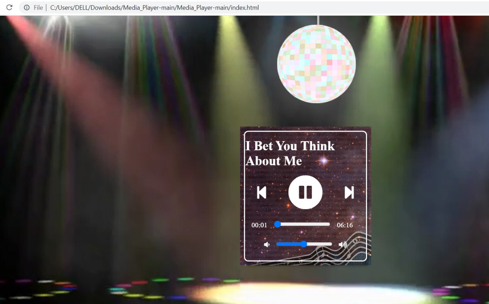

# MEDIA_PLAYER
# HTML JS CSS PROJECT
# MEDIA/SONGS PLAYING WEBSITE USING DOUBLY LINKED LIST
As streaming is increasingly being adopted by users, online media players have become essential for consuming media on the internet. A music player allows one to enjoy music on any browser and supports a lot of the features of a music player.
The application shall allow the user to freely distribute music over the internet. We have created a music player with a clean user interface that can be used to play music in the browser. We have also implement features like seeking and volume control. We have used a lot of HTML features to use the audio features and its playback. Apart from that, the player is made using Doubly Linked Lists for inserting and pushing songs from the internet. 

 

